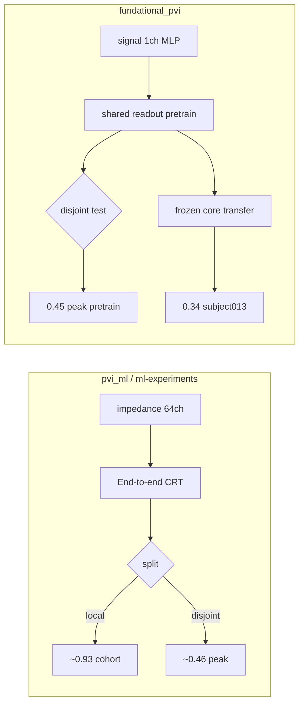

# Performance diagnosis: `fundational_pvi` vs `pvi_ml` / `ml-experiments`

Comparison of foundation-model results against the CRT/Samba pipelines in
`/mmfs1/projects/ece_bst/lsanc68/gia_bao/pvi_ml` and saved runs in
`/mmfs1/projects/ece_bst/lsanc68/ml-experiments`.

**Metric note:** `test_accuracy` / `cc_abs` = mean Pearson *r* of SBP and DBP
(min/max over the 50-point waveform). This is **not** classification accuracy.

---

## Headline: different problems are being compared

| What was trained | Best metric | Split | Input | Model |
|------------------|-------------|-------|-------|-------|
| **PW15 CRT** (`ml-experiments`) | **0.928** cc_abs | `local` (same subjects in train & test) | impedance (64 ch) | End-to-end CRT |
| **Foundation scaffold** (job 424458) | **0.445** cc_abs @ ep40 | `disjoint` (whole subjects held out) | **signal** (1 ch) | MLP core + shared linear readout |
| **Foundation transfer** subject013 | **0.336** cc_abs | within-subject | signal | Frozen core + readout only |
| **Foundation CRT** (job 424523, partial) | **0.327** cc_abs @ ep10 | `disjoint` | impedance | CRT core + shared linear readout |
| **CRT ablation disjoint** (`abl-crtsin`) | ~0.46 peak, 0.21 final | `disjoint` | impedance | End-to-end CRT |

The **0.93** number from PW15 is **not directly comparable** to foundation
transfer **~0.34** without matching split, input modality, and training paradigm.

---

## Results inventory (`fundational_pvi`)

### Scaffold pretrain — Core S (MLP, `signal`)

| Job | Arch | Input | Batch | Best test cc_abs | Best epoch | Final @ 499 |
|-----|------|-------|-------|------------------|------------|-------------|
| 424458 | MLP | signal | 512 | **0.445** | 40 | 0.274 |

Parquet cache: `/mmfs1/scratch/lsanc68/pvi_cache/v1`, `split_mode=disjoint`.

### Scaffold SSL — Core U (MLP, `signal`)

| Job | Notes |
|-----|-------|
| 424459 | Completed 500 epochs; SSL `total` loss → ~0; no cc_abs (reconstruction objective) |

### Production pretrain — CRT (Core S, `impedance`)

| Job | Cache | Status | Best test cc_abs | Best epoch |
|-----|-------|--------|------------------|------------|
| 424523 | `v1_impedance` | In progress | **0.327** | 10 |
| 424518 | none (lazy HDF5) | Abandoned | 0.347 @ ep1 | 1 |

### Production SSL — MAE (Core U, `impedance`)

| Job | Status |
|-----|--------|
| 424524 | Stopped ~ep16 |
| 424519, 424520 | Failed (import / argparse bugs; fixed in repo) |

### Transfer — subject013 (MLP scaffold, `signal`)

| Job | Core | Best test cc_abs | Notes |
|-----|------|------------------|-------|
| 424509 | Core S | **0.336** | Flat from epoch 0 (frozen core dominates) |
| 424510 | Core U | **0.305** | Peak ~ep449 |

### Exp B — budget curve (job 424512, subject013)

**cc_abs @ 4 min (primary comparison):**

| Method | cc_abs | AMAE (mmHg) |
|--------|--------|-------------|
| foundation_S | **0.336** | 78.6 |
| foundation_U | 0.326 | 98.3 |
| individual | -0.121 | 12.3 |

**@ 64 min budget:**

| Method | cc_abs | AMAE (mmHg) |
|--------|--------|-------------|
| foundation_S | 0.336 | **5.3** |
| foundation_U | 0.307 | 98 |
| individual | 0.088 | **6.0** |

Artifacts: `artifacts/exp-b-subject013/main/`.

---

## Reference: `pvi_ml` / `ml-experiments` best runs

### Population PW15 (bioz → waveform, `mask05`, `split_mode=local`)

| Model | Test cc_abs | Config / weights |
|-------|-------------|------------------|
| **PW15 depth-1 + cosine LR** | **0.928** | `ml-experiments/.../pw15-crt-bioz-to-waveform-ablation-depth-1-cosine/` |
| PW15 cosine LR | 0.926 | `pw15-crt-bioz-to-waveform-ablation-cosine-lr/` |
| PW19 Samba learnable PE | 0.914 | `pw19-samba-bioz-to-waveform-ablation-learnable/` |

**Checkpoint (on cluster):**

```
/home/lsanc68/artifacts/pw15-crt-bioz-to-waveform-ablation-depth-1-cosine/checkpoints/dataset_lazy_checkpoints_best.pth
```

**Waveform error (PW15 cosine-LR, interpretability target):** AMAE ≈ 3.69 mmHg,
SBP-MAE ≈ 4.44 mmHg, DBP-MAE ≈ 3.14 mmHg.

### Disjoint CRT baseline (fairer comparison to foundation pretrain)

| Run | Split | Peak / final cc_abs |
|-----|-------|---------------------|
| `abl-crtsin-bioz-to-waveform` | `disjoint` | ~0.46 peak; 0.21 @ ep30 final |

### Longitudinal transfer (`ml-experiments/_long`)

Subjects 002, 010, 070, 094, 095 — full-model fine-tune (not frozen core).

Example: subject002 linear d00→d01, test cc_abs **0.586** @ ep998.

Summary tables: `ml-experiments/current/artifacts/_long/_summary/`.

**Note:** `ml-experiments` stores configs, history, and predictions; model
weights live under `/home/lsanc68/artifacts/` (not in the git repo).

---

## Where performance is lost (ranked)

### 1. Train/test split — largest gap (~0.45–0.50 Pearson)

PW15 best run uses **`split_mode: "local"`** — test sequences from a subject
can sit beside training sequences from the **same** subject. Foundation pretrain
uses **`split_mode: "disjoint"`** — entire subjects are held out for test.

Foundation config (`artifacts/foundation-pretrain/main/configs/dataset_parquet_configs.json`):

```json
"split_params": {
  "test_size": 0.1,
  "shuffle": true,
  "split_mode": "disjoint",
  "random_state": 42
}
```

PW15 config (`ml-experiments/.../pw15-crt-bioz-to-waveform-ablation-depth-1-cosine/`):

```json
"split_mode": "local"
```

**Sanity check:** PW15 epoch 0 on `local` split is already **0.345** test cc_abs —
close to foundation CRT peak on `disjoint`. Split mode explains much of the
0.93 vs 0.45 gap, not a broken architecture.

### 2. Wrong input for completed transfer runs (signal vs impedance)

Completed scaffold pipeline used **`input_mode: signal`** (shape `[1, 250]`).

PW15 and strong `pvi_ml` models use **`impedance`** (64 channels: 32 R + 32 X;
`diff=2` → 192 effective conv channels).

Transfer on subject013 used the **signal** MLP core. Impedance CRT core transfer
has not been run yet.

### 3. Foundation paradigm caps transfer performance

**Pretrain** (`src/foundation/pretrain.py`): one **`SHARED_READOUT`** (single
linear layer) for all subjects during pooled training.

**PW15:** end-to-end CRT with a **3-layer MLP head** (256→256→50), jointly trained.

**Transfer** (`src/foundation/transfer.py`): core is **frozen**; only
`SubjectReadout` trains (default: single `Linear`, `readout_hidden=0`).

This explains transfer cc_abs **flat from epoch 0** at 0.336 — the frozen core
fixes correlation structure; the readout barely moves Pearson *r*.

### 4. Training recipe gaps vs PW15 best

| Setting | PW15 best | Foundation CRT (current) |
|---------|-----------|---------------------------|
| LR schedule | **CosineAnnealingLR** | ReduceLROnPlateau |
| Prediction head | Deep MLP (3 layers) | Linear `SubjectReadout` |
| Training | End-to-end | Encoder readout frozen, replaced |
| Epochs | 440 (complete) | ~41 (in progress at time of writing) |
| Best checkpoint | `*_best.pth` | Best @ ep10; export may use last epoch |

Scaffold pretrain lost **~0.17** Pearson by exporting epoch 499 (0.274) instead
of best @ ep40 (0.445).

### 5. Core U (SSL / MAE) is not trained for BP

`ml-experiments` always optimizes **`MorphologyLoss`** on waveforms.

Foundation Core U uses **masked reconstruction + forecasting** — no BP labels.
Low SSL loss does not imply good BP features. Core U transfer (0.305) did not
beat Core S (0.336) on subject013.

### 6. Early production job issues

| Job | Issue |
|-----|-------|
| 424518 | Lazy HDF5 (no impedance parquet cache) — very slow |
| 424523 | Parquet; training in progress |
| 424524 | MAE SSL stopped early (~ep16) |

Impedance parquet cache: `/mmfs1/scratch/lsanc68/pvi_cache/v1_impedance`
(build via `sbatch src/launch_build_cache_impedance.sh`).

---

## Architecture & protocol comparison

| Aspect | `pvi_ml` / `ml-experiments` | `fundational_pvi` |
|--------|------------------------------|-------------------|
| Paradigm | End-to-end supervised per architecture | Pooled pretrain → frozen core + subject readout |
| Pretrain objective | MorphologyLoss on BP | Core S: supervised; Core U: SSL (MAE) |
| Transfer | Longitudinal full-model fine-tune | Freeze core; train readout only |
| Data loader | `PviLazyDataset` (HDF5) | Parquet cache or lazy HDF5 |
| Cohort split (pretrain) | `local` (PW15 best) | `disjoint` |
| Best published cohort metric | CRT **0.928** (`local`) | Scaffold **0.445** (`disjoint`) |
| Best transfer (subject013) | N/A in `_long` (not in 5-subject set) | **0.336** (frozen Core S) |



---

## Recommended next steps

1. **Fair baseline:** Run PW15 CRT with `split_mode=disjoint` on the same
   91-subject cohort (or evaluate existing `abl-crtsin` on the same split seed).

2. **Finish CRT impedance pretrain** to 500 epochs; consider **CosineAnnealingLR**
   to match PW15 best recipe.

3. **Export best checkpoint, not last** — use `*_best.pth` / early-stopper best
   when saving `foundation_core.pt`.

4. **Transfer with impedance CRT core**, not signal MLP scaffold.

5. **Relax frozen-core constraint on transfer** — try `readout_hidden > 0`,
   unfreeze top encoder layers, or fine-tune full PW15 checkpoint on subject013
   (longitudinal protocol in `_long` reaches **0.58+** Pearson on subject002).

6. **Revisit Core U** — supervised CRT/Samba core may be better for BP transfer
   than MAE SSL unless SSL is tuned for downstream BP.

7. **Fair benchmark script (future):** Load PW15 best weights, evaluate on
   foundation's disjoint test subjects; run subject013 transfer with full
   fine-tune vs frozen-core side by side.

---

## Key paths

| Resource | Path |
|----------|------|
| PW15 best config | `ml-experiments/current/artifacts/pw15-crt-bioz-to-waveform-ablation-depth-1-cosine/configs/dataset_lazy_configs.json` |
| PW15 best weights | `/home/lsanc68/artifacts/pw15-crt-bioz-to-waveform-ablation-depth-1-cosine/checkpoints/dataset_lazy_checkpoints_best.pth` |
| Disjoint CRT ablation | `ml-experiments/current/artifacts/abl-crtsin-bioz-to-waveform/main/` |
| Foundation scaffold core | `artifacts/foundation-pretrain/main/foundation_core.pt` |
| Signal parquet cache | `/mmfs1/scratch/lsanc68/pvi_cache/v1` |
| Impedance parquet cache | `/mmfs1/scratch/lsanc68/pvi_cache/v1_impedance` |
| Run history | `RUNLOG.md` |

---

*Last updated: 2026-06-30. Revisit after CRT/MAE production jobs complete.*
